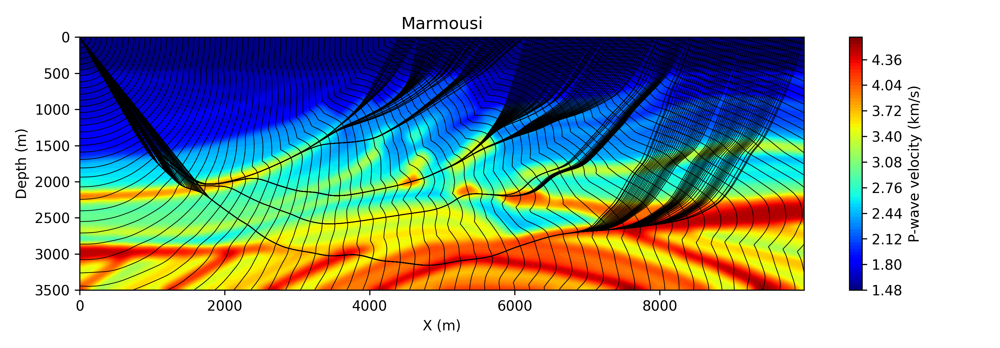

*******
FTeikPy
*******

FTeikPy is a Python package that computes accurate first arrival traveltimes in
2-D and 3-D heterogeneous isotropic velocity model, with the possibility to use
a different grid spacing in Z, X and Y directions. The algorithm handles
properly the curvature of wavefronts close to the source. The source can be
placed without any problem between grid points.

:Version: 1.0.3
:Author: Mark Noble
:Maintainer: Keurfon Luu
:Web site: https://github.com/keurfonluu/fteikpy
:Copyright: This document has been placed in the public domain.
:License: FTeikPy is released under the MIT License.

**NOTE**: the 2-D and 3-D Eikonal solvers included in FTeikPy are written in
Fortran. The original source codes can be found `here <https://github.com/Mark-Noble/FTEIK2D>`__.
Detailed implementation of local operators and global propagation scheme
implemented in this package are inspired from [1]_. If you find this algorithm
and/or package useful, citing this paper would be appreciated.

Installation
============

The recommended way to install FTeikPy is through pip (internet required):

.. code-block:: bash

    pip install fteikpy
    
Otherwise, download and extract the package, then run:

.. code-block:: bash

    python setup.py install
    

Usage
=====

First, import FTeikPy and define (or import) your velocity model (here in 2-D):

.. code-block:: python

    import numpy as np
    from fteikpy import Eikonal
    
    nz, nx = 351, 1000
    dz, dx = 10., 10.
    vel2d = np.full((nz, nx), 1500.)
    
Then, initialize the Eikonal solver:

.. code-block:: python

    eik = Eikonal(vel2d, grid_size = (dz, dx), n_sweep = 2)
    
Finally, for a given source point with coordinate (z,x), run the method *solve*:

.. code-block:: python
    
    source = (0., 5000.)
    tt = eik.solve(source)
    
The same can be done on a 3-D velocity model (just a bit slower...).

    
Troubleshooting on Windows
==========================

A Fortran compiler is required to install this package. While it is
straightforward on Unix systems, it can be quite a pain on Windows. We recommend
installing `Anaconda <https://www.continuum.io/downloads>`__ that contains all
the required packages to install FTeikPy on Windows systems.

1. Download `MinGW 64 bits <https://sourceforge.net/projects/mingw-w64/files/>`__
   (choose *x86_64-posix-sjlj*) and extract the archive in your drive root.
   
2. Add MinGW to your system path:

    C:\\<Your MinGW directory>\\bin
    
3. Create the file *distutils.cfg* in *<Your Python directory path>\\Lib\\distutils*
   with the following content to use MinGW compiler:
   
.. code-block::

    [build]
    compiler=mingw32
    
4. Open a terminal and install *libpython*:

.. code-block:: batch

    conda install libpython

If you got the error:

    Error: ValueError: Unknown MS Compiler version 1900
    
You may need to manually patch the file *cygwinccompiler.py* located in:

    <Your Python directory path>\\Lib\\distutils
    
by replacing:

.. code-block:: python

    self.dll_libraries = get_msvcr()
    
in lines 157 and 318 by (be careful with indentation):

.. code-block:: python

    pass

You should also patch the file *mingw32compiler.py* located in:

    <Your Python directory path>\\Lib\\site-packages\\numpy\\distutils
    
by commenting out from lines 96 to 104:

.. code-block:: python

    #        msvcr_success = build_msvcr_library()
    #        msvcr_dbg_success = build_msvcr_library(debug=True)
    #        if msvcr_success or msvcr_dbg_success:
    #            # add preprocessor statement for using customized msvcr lib
    #            self.define_macro('NPY_MINGW_USE_CUSTOM_MSVCR')
    #
    #        # Define the MSVC version as hint for MinGW
    #        msvcr_version = '0x%03i0' % int(msvc_runtime_library().lstrip('msvcr'))
    #        self.define_macro('__MSVCRT_VERSION__', msvcr_version)
    

References
==========
.. [1] M. Noble, A. Gesret and N. Belayouni, *Accurate 3-D finite difference
       computation of traveltimes in strongly heterogeneous media*, Geophysical
       Journal International, 2014, 199(3): 1572-1585